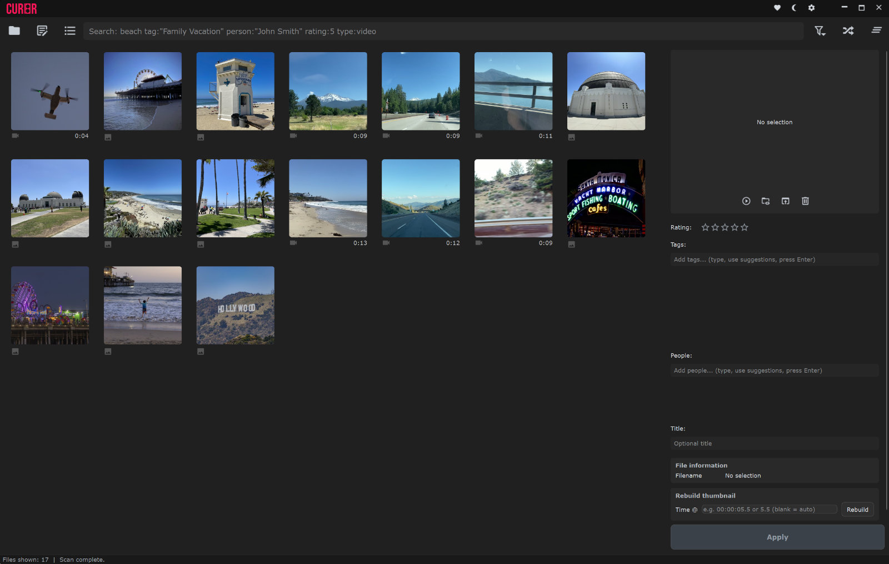
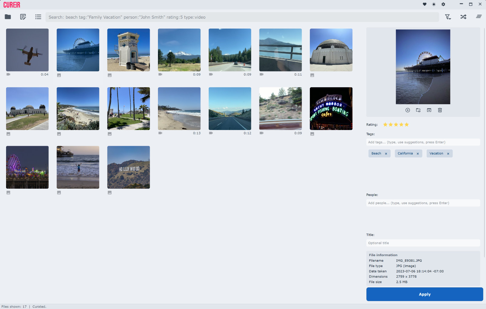

# CUR8R Media Manager

  

A lightweight desktop application for organizing, browsing, and tagging your media collection. Scans folders, generates thumbnails, and lets you manage images, videos, and audio files from a single interface.

## Features

- Scan local folders and index media files into a SQLite library
- Generate and cache thumbnails for images, videos, and audio
- Browse and filter your library through a dark-themed Qt6 UI
- Tag and bulk-edit media metadata
- Export metadata via ExifTool
- CLI mode for headless/scripted use

---

## Download

**[Download the latest release →](../../releases/latest)**

Unzip and run — no installation required.

---

## Screenshots

| Dark mode | Light mode |
|-----------|------------|
|  |  |

---

## Supported Formats

| Type | Extensions |
|------|-----------|
| Image | `.jpg` `.jpeg` `.png` `.webp` `.bmp` `.gif` `.heic` `.heif` `.avif` |
| Video | `.mp4` `.mkv` `.mov` `.avi` `.m4v` `.webm` `.wmv` `.flv` `.mpg` `.mpeg` `.ts` `.m2ts` `.mts` `.3gp` `.mxf` |
| Audio | `.mp3` `.wav` `.flac` `.aac` `.m4a` |

---

## System Requirements

- Windows 10 or Windows 11 (64-bit)
- No additional software required — FFmpeg, FFprobe, and ExifTool are bundled

---

## Installation

1. Download `CUR8R-Media-Manager-vX.X.X.zip` from the [Releases page](../../releases)
2. Extract the zip to any folder (e.g. `C:\Programs\CUR8R\`)
3. Double-click `CUR8R.exe` to launch

On first run you'll be prompted to choose a library folder — this is where CUR8R stores its database, thumbnails, and settings.

---

## Quick Start

1. **Add a media folder** — On first launch, or via *Settings > Manage Folders*, point CUR8R at your media folder
2. **Scan** — CUR8R indexes all supported files and generates thumbnails in the background
3. **Browse** — Filter by type, tag, or search by filename
4. **Tag** — Select files and use the tag panel or bulk-edit to add/remove tags
5. **Export metadata** — Use the ExifTool export option to write tags back to file metadata

---

## Known Limitations

- Windows only (no macOS/Linux build at this time)
- Very large libraries (100k+ files) may take several minutes to scan on first run
- HEIC/AVIF thumbnail generation requires the bundled FFmpeg build

---

## Reporting Issues

Found a bug? [Open an issue](../../issues/new/choose) and include your Windows version, the steps to reproduce, and any error messages shown.

---

## License

FFmpeg and FFprobe are bundled under the LGPL. See the `licenses/ffmpeg/` folder inside the zip for details and source code link.
